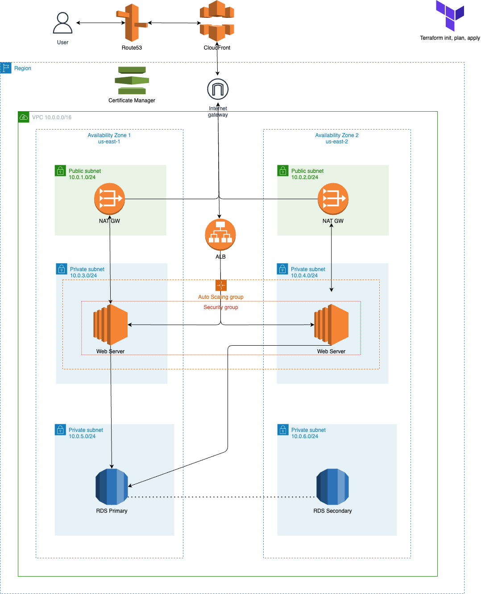
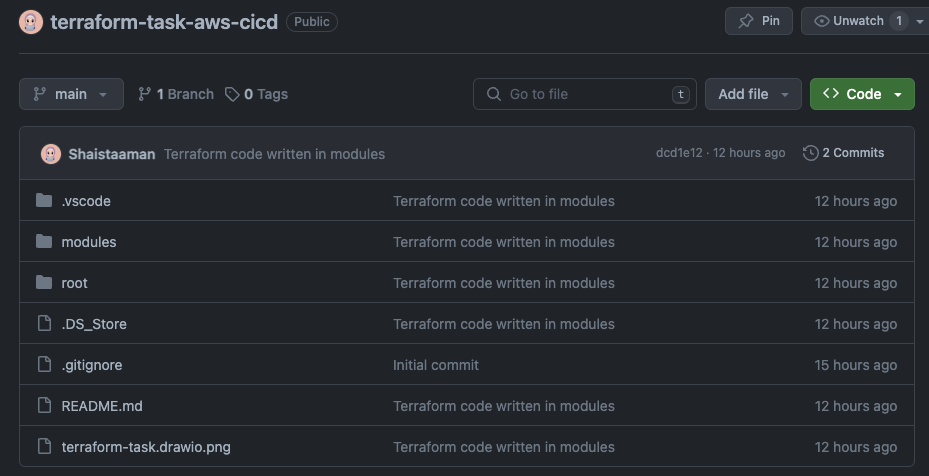

# Terraform-Task-AWS-CICD

Demo for the task assigned about 3 tier architecture implementation by terraform in AWS using AWS code pipeline.

## Task Details

Design a scalable, secure, cost-effective three-tier web application architecture on AWS using Terraform as Infrastructure as Code (IaC). Additionally, provide a high-level CI/CD pipeline design that includes the key stages and tools that would be used for the automated deployment and management of the application infrastructure and code.

### Tasks:

1. AWS Infrastructure Provisioning with IaC:
   Write Terraform templates to provision the necessary AWS resources application. Your IaC scripts should automate the creation of all required components for the application.

2. CI/CD Pipeline Design:
   Create a high-level CI/CD pipeline design outlining the stages for code integration,testing, and deployment.

The design should include:
Source control management (e.g., AWS CodeCommit, GitHub). Continuous integration services (e.g., AWS CodeBuild, Jenkins). Continuous deployment services (e.g., AWS CodeDeploy, Spinnaker). Pipeline orchestration (e.g., AWS CodePipeline, GitLab CI/CD). Monitoring and notification mechanisms.

# Solution

## Architecture



### Prerequisite

**Note**:
AWS CLI setup on the system.
AWS profile setup on system.
Terraform installed on the system.

### Create S3 Backend Bucket

Create an S3 bucket to store the .tfstate file in the remote backend

**Warning!** It is highly recommended that you `enable Bucket Versioning` on the S3 bucket to allow for state recovery in the case of accidental deletions and human error.

### Create a Dynamo DB table for state file locking

- Give the table a name
- Make sure to add a `Partition key` with the name `LockID` and type as `String`

### Generate a public-private key pair for our instances

We need a public key and a private key for our server so please follow the procedure I've included below.

```sh
cd modules/key/
ssh-keygen
```

The above command asks for the key name and then gives `client_key` it will create pair of keys one public and one private. you can give any name you want but then you need to edit the Terraform file

Edit the below file according to your configuration

```sh
vim root/backend.tf
```

Add the below code in root/backend.tf

```sh
terraform {
  backend "s3" {
    bucket = "BUCKET_NAME"
    key    = "backend/FILE_NAME_TO_STORE_STATE.tfstate"
    region = "us-east-1"
    dynamodb_table = "dynamoDB_TABLE_NAME"
  }
}
```

### Variables for Infrastructure

Create one file in root directoy with the name of `terraform.tfvars`

```sh
vim root/terraform.tfvars
```

Add the below content into the `root/terraform.tfvars` file and add the values of each variable.

```javascript
region = "";
project_name = "";
vpc_cidr = "";
pub_sub_1a_cidr = "";
pub_sub_2b_cidr = "";
pri_sub_3a_cidr = "";
pri_sub_4b_cidr = "";
pri_sub_5a_cidr = "";
pri_sub_6b_cidr = "";
db_username = "";
db_password = "";
certificate_domain_name = "";
additional_domain_name = "";
```

### ACM certificate

Go to AWS console --> AWS Certificate Manager (ACM) and make sure you have a valid certificate in Issued status, if not , feel free to create one and use the domain name on which you are planning to host your application.

### Route 53 Hosted Zone

Go to AWS Console --> Route53 --> Hosted Zones and ensure you have a public hosted zone available, if not create one.

## Now deploy application on the cloud via local setup

First of all create a IAM user in the AWS Console and give the user suitable rights or Admin Access for test.

then on PC create AWS user profile with your access_Key and Secret_Key by these commands

```sh
aws configure --profile [profilename]
```

Once the profile is created set it as default one to run terraform commands seamlessly.

```sh
set AWS_DEFAULT_PROFILE=account1
$ aws s3 ls
```

get into the project directory

```sh
cd root
```

Install dependency to deploy the application

```sh
terraform init
```

Type the below command to see the plan of the execution

```sh
terraform plan
```

Finally, HIT the below command to deploy the application...

```sh
terraform apply
```

Type `yes`, and it will prompt you for approval..

# Setting up CI/CD

For this task I have selected Github as a source repository and AWS Code Build to build and deploy the architecture.

## Github Setup

First of all set a github repository with a README and terraform gitignore file. Then push the code into the repossitory. Make sure the directory structure should look like 

We will also need a github personal access token to allow AWS Code Build to fetch code and make build to deploy. For this Go to Github Settings -> Developer settings and generate personal access token with suitable permission. For this task I selected repo and admin:repo_hook.

## Code Build Setup

In AWS code build window set proper configuration to build the solution in aAmazon Linux container and deploy the resources. For this task by using the github personal access token I selected Github repo and in webhook I selected Single build on PUSH. In environment section I selected Amazon Linux latest and all environment variables that are referenced in configure-named-profile.sh file.
$AWS_ACCESS_KEY_ID 
$AWS_SECRET_ACCESS_KEY
$AWS_REGION
$PROFILE_NAME

Buildspec.yml file is cicd folder, make sure to write the exact path for this while configuration

```sh
cicd/buildspec.yml
```

Once created you can run the build from AWS Code Build console or whenever you push your code to the repo, AWS Code Build Webhook will automatically detected the push and run the Code Build routine.
