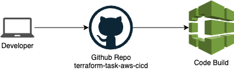
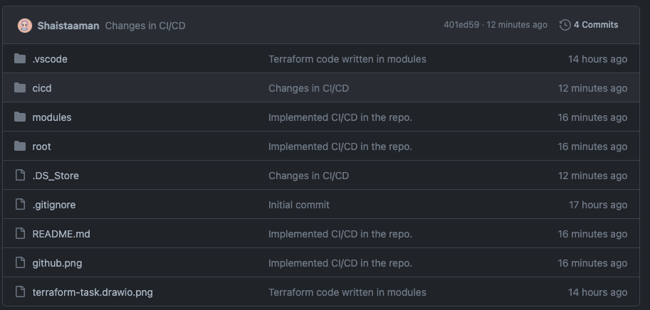
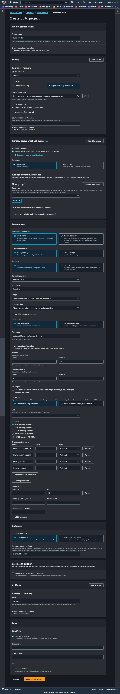

# Terraform-Task-AWS-CICD

Demo for the task assigned about 3 tier architecture implementation by terraform in AWS using AWS code pipeline.

## Task Details

Design a scalable, secure, cost-effective three-tier web application architecture on AWS using Terraform as Infrastructure as Code (IaC). Additionally, provide a high-level CI/CD pipeline design that includes the key stages and tools that would be used for the automated deployment and management of the application infrastructure and code.

### Deliverables

- Describing the architecture of the application along with brief reasoning for your design choices.
- IaC scripts that can be used to provision and manage the AWS infrastructure.
- A document detailing the high-level CI/CD pipeline design, including a diagram and a description of each stage and the tools involved.

### Tasks:

1. AWS Infrastructure Provisioning with IaC:
   Write Terraform templates to provision the necessary AWS resources application. Your IaC scripts should automate the creation of all required components for the application.

2. CI/CD Pipeline Design:
   Create a high-level CI/CD pipeline design outlining the stages for code integration,testing, and deployment.

The design should include:
Source control management (e.g., AWS CodeCommit, GitHub). Continuous integration services (e.g., AWS CodeBuild, Jenkins). Continuous deployment services (e.g., AWS CodeDeploy, Spinnaker). Pipeline orchestration (e.g., AWS CodePipeline, GitLab CI/CD). Monitoring and notification mechanisms.

# Solution

## Architecture


### Prerequisite

**Note**:
AWS CLI setup on the system.
AWS profile setup on system.
Terraform installed on the system.

### Create S3 Backend Bucket

Create an S3 bucket to store the .tfstate file in the remote backend

**Warning!** It is highly recommended that you `enable Bucket Versioning` on the S3 bucket to allow for state recovery in the case of accidental deletions and human error.

### Create a Dynamo DB table for state file locking

- Give the table a name
- Make sure to add a `Partition key` with the name `LockID` and type as `String`

### Generate a public-private key pair for our instances

We need a public key and a private key for our server so please follow the procedure I've included below.

```sh
cd modules/key/
ssh-keygen
```

The above command asks for the key name and then gives `client_key` it will create pair of keys one public and one private. you can give any name you want but then you need to edit the Terraform file

Edit the below file according to your configuration

```sh
vim root/backend.tf
```

Add the below code in root/backend.tf

```sh
terraform {
  backend "s3" {
    bucket = "BUCKET_NAME"
    key    = "backend/FILE_NAME_TO_STORE_STATE.tfstate"
    region = "us-east-1"
    dynamodb_table = "dynamoDB_TABLE_NAME"
  }
}
```

### Variables for Infrastructure

Create one file in root directoy with the name of `terraform.tfvars`

```sh
vim root/terraform.tfvars
```

Add the below content into the `root/terraform.tfvars` file and add the values of each variable.

```javascript
region = "";
project_name = "";
vpc_cidr = "";
pub_sub_1a_cidr = "";
pub_sub_2b_cidr = "";
pri_sub_3a_cidr = "";
pri_sub_4b_cidr = "";
pri_sub_5a_cidr = "";
pri_sub_6b_cidr = "";
db_username = "";
db_password = "";
certificate_domain_name = "";
additional_domain_name = "";
```

### ACM certificate

Go to AWS console --> AWS Certificate Manager (ACM) and make sure you have a valid certificate in Issued status, if not , feel free to create one and use the domain name on which you are planning to host your application.

### Route 53 Hosted Zone

Go to AWS Console --> Route53 --> Hosted Zones and ensure you have a public hosted zone available, if not create one.

## Now deploy application on the cloud via local setup

First of all create a IAM user in the AWS Console and give the user suitable rights or Admin Access for test.

then on PC create AWS user profile with your access_Key and Secret_Key by these commands

```sh
aws configure --profile [profilename]
```

Once the profile is created set it as default one to run terraform commands seamlessly.

```sh
set AWS_DEFAULT_PROFILE=account1
$ aws s3 ls
```

get into the project directory

```sh
cd root
```

Install dependency to deploy the application

```sh
terraform init
```

Type the below command to see the plan of the execution

```sh
terraform plan
```

Finally, HIT the below command to deploy the application...

```sh
terraform apply
```

Type `yes`, and it will prompt you for approval..

# Setting up CI/CD

For this task I have selected Github as a source repository and AWS Code Build to build and deploy the architecture.



## Github Setup

First of all set a github repository with a README and terraform gitignore file. Then push the code into the repossitory. Make sure the directory structure should look like 

We will also need a github personal access token to allow AWS Code Build to fetch code and make build to deploy. For this Go to Github Settings -> Developer settings and generate personal access token with suitable permission. For this task I selected repo and admin:repo_hook.

## Code Build Setup

In AWS code build window set proper configuration to build the solution in aAmazon Linux container and deploy the resources. For this task by using the github personal access token I selected Github repo and in webhook I selected Single build on PUSH. In environment section I selected Amazon Linux latest and all environment variables that are referenced in configure-named-profile.sh file.
$AWS_ACCESS_KEY_ID 
$AWS_SECRET_ACCESS_KEY
$AWS_REGION
$PROFILE_NAME



Buildspec.yml file is cicd folder, make sure to write the exact path for this while configuration

```sh
cicd/buildspec.yml
```

Once created you can run the build from AWS Code Build console or whenever you push your code to the repo, AWS Code Build Webhook will automatically detected the push and run the Code Build routine.

## Code Cleanup

In the end to avoid additional bill you have to clean up the resources created. For that go to apply-terraform.sh file and comment the

```sh
terraform apply -auto-approve
```

and uncomment

```sh
terraform destroy -auto-approve
```

after that just push the code in github repo rest will be taken care by the scripts.

### Closing Notes

At this stage all the resources created by scripts and terraform files will be deleted except the resources we manually created. So to you have to manually delete the route53 hosted zone, certifate in ACM, Dynamodb table and S3 bucket terraform remote backend state management.

# Reasons for Architecture Selection

This section outlines a cost-effective, scalable, and secure three-tier architecture for deploying the said application on AWS using Terraform and a CI/CD pipeline. We'll prioritize EC2 instances over serverless options for secure, greater control and potential cost savings for this specific application.

## AWS Infrastructure Provisioning with Terraform:

1.1 VPC and Subnets:

Create a VPC with multiple Availability Zones (AZs) for redundancy.
Define public and private subnets within each AZ for security separation.
Assign public subnets to the route traffic via NAT, private subnets to the Application Tier (web servers) and private subnets to the Database Tier.

1.2 EC2 Instances:

Use Auto Scaling groups for the Application Tier with on-demand EC2 instances in the public subnets.
Choose instance types (e.g., t2.small) based on project expected traffic and resource needs.
Configure Auto Scaling based on CPU utilization or custom metrics for cost-effective scaling.
Implement Launch Templates for consistent configuration across the instances.

1.3 Database:

Use Amazon RDS for the Database Tier, choosing an appropriate database engine like MySQL or PostgreSQL.
Utilize RDS Multi-AZ deployments for high availability and database primary secondary options.

1.4 Load Balancers and Route 53:

Utilize an Application Load Balancer (ALB) in the public subnet to distribute traffic across the Application Tier instances.
Configure the ALB with health checks to ensure only healthy instances receive traffic.
Set up a Route 53 hosted zone with a record pointing to the ALB's DNS name for external access.

1.5 Additional Resources:

Implement Security Groups to restrict inbound and outbound traffic for each tier.

2. CI/CD Pipeline Design:

2.1 Source Control and Continuous Integration:

Store project's code in a Git repository (e.g., GitHub, external Git).
Use AWS CodeBuild for CI:
Connect to the Git repository.
Build and package the application code.
Deploy directly to EC2 instances from CodeBuild scripts.

2.2 Continuous Deployment:

Direct deployment from CodeBuild scripts is used, eliminating the need for a separate CD service like CodeDeploy.

## Additional Considerations:

Evaluate the trade-offs between simplicity, control, and visibility when choosing between

- server and serverless architechtre
- direct deployment from CodeBuild and using a separate CD service.

Ensure robust security measures and monitoring are in place.
Choose appropriately sized EC2 instances and utilize Auto Scaling to avoid overprovisioning resources.
Consider Reserved Instances for predictable workloads to further reduce costs.
Use Spot Instances if available for less critical tasks within the application.
Leverage managed services like RDS for resource optimization and automated maintenance.
Regularly review and optimize resource allocation based on actual usage.

Benefits of Selected Implementation:

- Control and flexibility: EC2 instances offer greater control over configuration and scaling compared to serverless options.
  Cost-effectiveness: With careful planning and optimization, EC2 can be cost-effective for project's expected usage.

- Maturity and familiarity: Existing knowledge and tools for managing EC2 instances facilitate easier setup and maintenance.

This document provides a cost-effective and scalable architecture for deploying project on AWS using Terraform and a CI/CD pipeline. By utilizing EC2 instances with careful sizing and automation, you can achieve efficient resource utilization and optimize costs while still benefiting from the control and flexibility offered by this approach.

This is a high-level overview, and specific configurations will depend on project's specific requirements and traffic patterns. Further detailed instructions and code examples can be developed based on this framework for a complete implementation.
